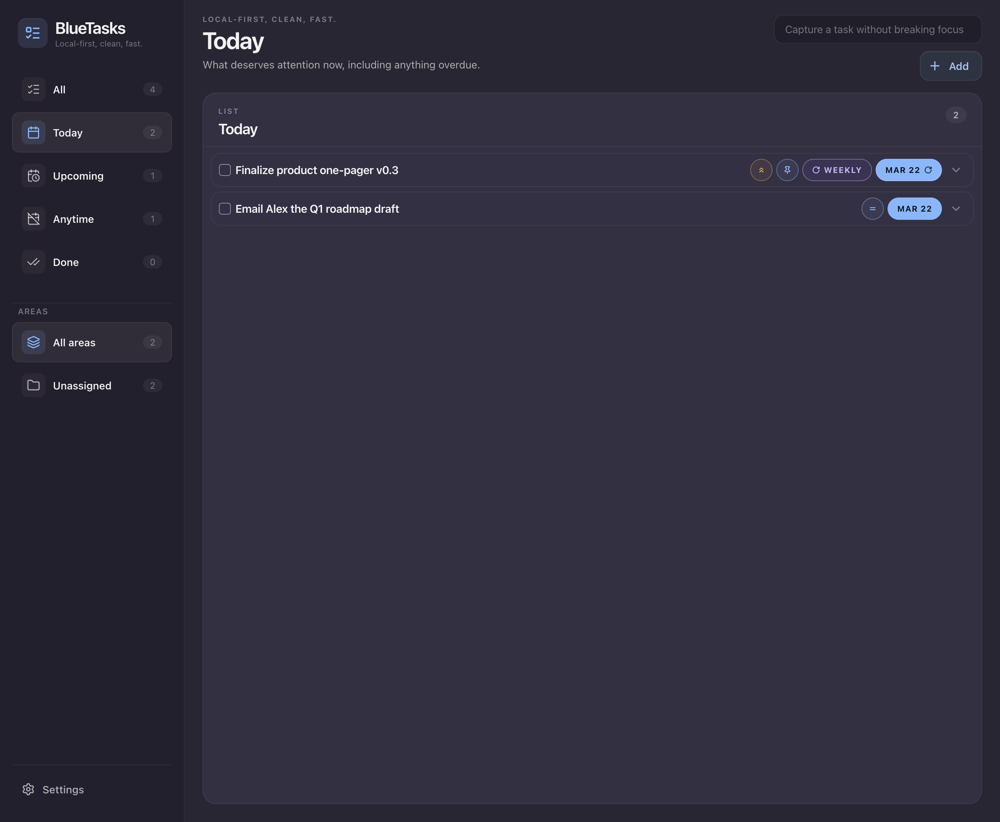
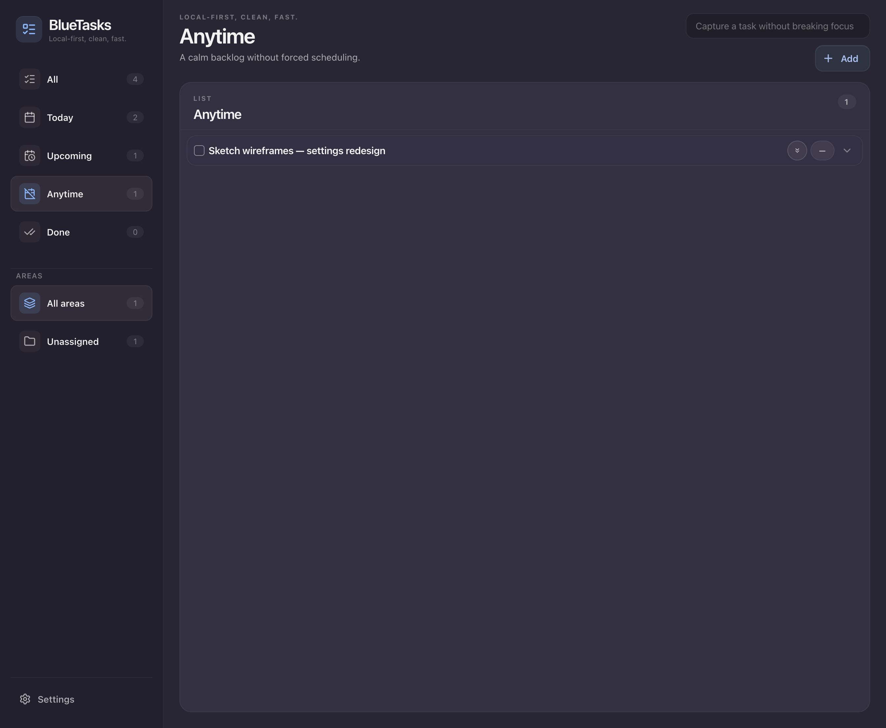
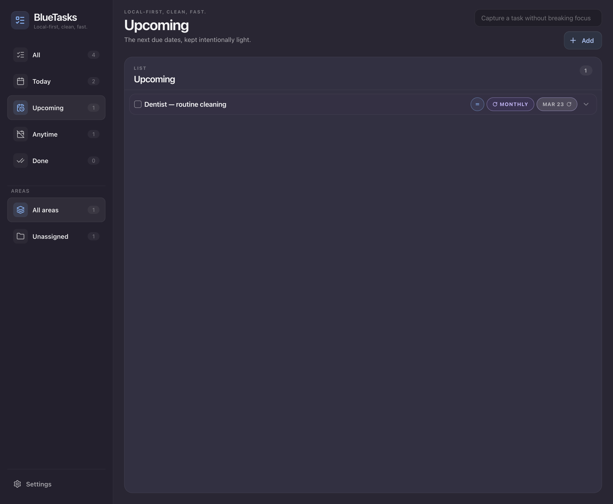
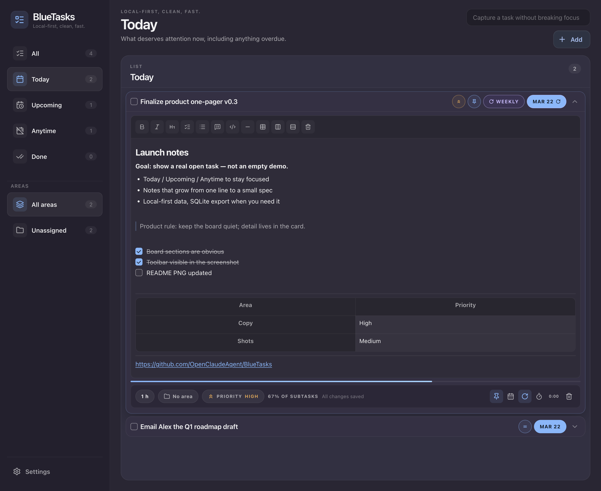

# BlueTasks

**BlueTasks** is a calm, **local-first** task board: your data stays in **SQLite** on your machine, the UI stays fast, and each task can grow from a single line into a full note when you need it.

License [MIT](LICENSE) · [Changelog](CHANGELOG.md)

## What you get

- **Focused lists** — *Today*, *Upcoming*, *Anytime*, and *Done* so you see the right workload at the right time, not an endless flat inbox.
- **Expandable cards** — Open a task for a full editor: **rich text** (headings, bold, italic, bullets, checklists, quotes, code blocks, tables, dividers), **priority**, **pin**, **due date**, **recurrence**, **time estimate**, and a **timer** when you want to track focus.
- **Areas** — Group work by project or life domain and filter the board from the sidebar.
- **Quick capture** — Add a thought from the top bar without losing your place on the board.
- **Your data, your disk** — Export or import the whole database as `.sqlite` from Settings; copy `.data/` for a raw backup.
- **Interface languages** — English by default, plus French, German, Spanish, Italian, Dutch, Polish, Portuguese, and Japanese (switch in Settings).

## Screenshots

Real UI (English) — same app you get from the **[latest release](https://github.com/OpenClaudeAgent/BlueTasks/releases/latest)**.

### Board views

| **Today** | **Anytime** | **Upcoming** |
| :---: | :---: | :---: |
|  |  |  |
| *What needs attention now — scan the day in seconds.* | *Ideas and someday tasks without forced scheduling.* | *Light list of what's next, including recurring items.* |

### Rich notes inside a task



*Open a card for headings, lists, checklists, quotes, code, tables — plus estimate, area, priority, pin, schedule, repeat, and timer in the footer.*

## Install and run

### Recommended: download the latest release

**[→ Latest GitHub release](https://github.com/OpenClaudeAgent/BlueTasks/releases/latest)**

Pick the **desktop installer or archive** for your OS (**macOS**, **Windows**, **Linux**). Those assets are built and attached automatically by **GitHub Actions** — no compile step on your side.

### Other ways to run

**Node (server only, browser UI)** — useful for development or a headless host. Requires [Node.js 22](https://nodejs.org/).

```bash
git clone https://github.com/OpenClaudeAgent/BlueTasks.git
cd BlueTasks
npm install
npm run build
npm run start
```

Then open **[http://localhost:8787](http://localhost:8787)** in your browser. Data under `**.data/`** at the project root (`bluetasks.sqlite`).

**Docker (prebuilt image)** — good for servers or homelab. Pick a tag from [Releases](https://github.com/OpenClaudeAgent/BlueTasks/tags) (or `:latest`):

```bash
docker pull ghcr.io/openclaudeagent/bluetasks:latest
mkdir -p ./bluetasks-data
docker run --rm -d \
  --name bluetasks \
  -p 8787:8787 \
  -v "$(pwd)/bluetasks-data:/app/.data" \
  ghcr.io/openclaudeagent/bluetasks:latest
```

**Docker Compose (from source)**

```bash
git clone https://github.com/OpenClaudeAgent/BlueTasks.git
cd BlueTasks
npm run docker:release
docker compose up --build -d
```

More on Docker: [docs/docker.md](docs/docker.md).

### Building the desktop app from source

For contributors or custom builds: Rust + Node 22, `npm run desktop:prep`, then `npm run tauri build` or `npm run tauri dev` from `desktop/`. Full steps: **[desktop/README.md](desktop/README.md)**.

## Using the app

- **Desktop (Tauri):** the app opens the UI for you; data lives in the OS app data directory (see [desktop/README.md](desktop/README.md)).
- **Browser + `npm run start` or Docker:** open **[http://localhost:8787](http://localhost:8787)** (or the URL your setup prints). Data in `**.data/`** (or the volume you mounted for Docker).

## Backup

- **In the app:** Settings → General → export / import a `.sqlite` file.
- **Files:** for **Node / Docker**, copy `**.data/`** (or your Docker volume). For **Tauri**, SQLite lives under the OS app data directory — see [desktop/README.md](desktop/README.md).

## Repository layout

High level: `web/app` (React UI), `server` (API + SQLite), `contract` (shared types/schemas), `desktop` (Tauri), `e2e` (Playwright), `scripts` (build / Docker / desktop). See [docs/architecture.md](docs/architecture.md).

## Documentation and development

More topics (product, data model, i18n, tests, releases): **[docs/](docs/)**.

Run the full stack locally:

```bash
npm install
npm run dev
```

- UI: [http://localhost:5173](http://localhost:5173) · API: [http://localhost:8787](http://localhost:8787) (root `npm run dev` starts both.)

Same checks as CI: `npm run ci` — details in [docs/quality.md](docs/quality.md).

Optional: `web/app/.env` with `VITE_API_ORIGIN=https://your-api` (no trailing slash) if the API is not on `localhost:8787`.

**Shipping releases:** maintainers use the GitHub **Actions → Release** workflow (see [docs/releasing.md](docs/releasing.md)). Forks: replace `OpenClaudeAgent/BlueTasks` and `openclaudeagent` in URLs / image names with your org.

---

[CI](https://github.com/OpenClaudeAgent/BlueTasks/actions/workflows/ci.yml)
[Docker image](https://github.com/OpenClaudeAgent/BlueTasks/actions/workflows/docker-publish.yml)