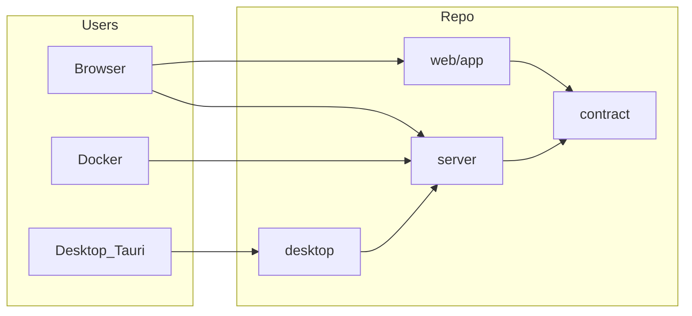

# BlueTasks architecture

## Repository layout

npm **workspaces** at the root: `web/app` (`@bluetasks/app`) and `server` (`@bluetasks/server`). Other top-level folders are not separate npm packages but belong to the same repo.

```text
BlueTasks/
├── contract/      Zod + shared API contract checks (Vitest + Playwright import these)
├── desktop/       Tauri shell (embedded Node + same server bundle as Docker)
├── docs/          Product, quality, Docker, releasing, this file
├── e2e/           Playwright specs (production-shaped server on 8787)
├── scripts/       Docker context, desktop runtime assembly, embedded Node fetch
├── server/        Express API, SQLite, serves `web/app/dist` in production
├── shared/        JSON and assets shared without cross-workspace deps (e.g. category icon ids)
└── web/app/       React + Vite client
```

High-level data flow:



The root [README](../README.md) summarizes this tree in one paragraph for new contributors.

## Repositories and runtime

- **`web/app`** — React client (Vite), UI, i18n, HTTP calls to the API.
- **`server`** — Express API, **SQLite** persistence (`better-sqlite3`), serves the static client build in production.

In development the front runs on the Vite port (e.g. 5173) and talks to the API on **8787** (same origin or `VITE_API_ORIGIN`). In production the server serves `web/app/dist` and exposes the API and static files on one host.

## Category icons (canonical list)

**`server/data/category-icon-ids.json`** is the canonical list of icon ids for categories (next to server code that validates them).

- The **server** loads this JSON at startup (`server/src/categoryIconIds.ts`) and rejects unknown values via `normalizeCategoryIcon`.
- The **client** imports the same file via the `@bluetasks/server-data` alias in `web/app/src/lib/categoryIcons.ts` and maps each id to a Lucide component. A guard at module load checks that the map and JSON stay aligned.

Adding an icon requires updating the JSON, the Lucide map on the web app, and any UI copy (picker).

## Task data flow

- List / create / update / delete via REST on the server.
- The main board is driven by **`useBlueTasksBoard`** (`web/app/src/hooks/useBlueTasksBoard.ts`): loading, filters by section and category, debounced autosave with revision guards so newer edits are not overwritten.

## Database export and import

- **`GET /api/export/database`** — `VACUUM INTO` to a temp file, then download as `.sqlite` (`Content-Disposition: attachment`). **Settings → General** — “Export SQLite database”.
- **`POST /api/import/database`** — **multipart** body, field **`database`** (a BlueTasks-compatible `.sqlite`). Atomically replaces the production SQLite file after validation and migrations. **Settings → General** — “Import SQLite database” (confirmation required). Returns `501` if the DB is `:memory:` (tests).

## Docker

- **JS build** (Vite + `tsc`) runs on the developer machine or **GitHub Actions**; the Docker context (`.dockerctx/`) only ships `dist` outputs and lockfiles. **`npm ci`** for production server deps runs in a **Linux** Docker stage (`deps`), then the final image has no toolchain. Details and GHCR: [`docs/docker.md`](docker.md).
- Data under **`/app/.data`** (e.g. `./.data` with `docker-compose`). Env: `HOST=0.0.0.0`, `PORT=8787`.

## Server layout (tests)

- `server/src/index.ts` — entry: open SQLite, `createApp`, listen.
- `server/src/createApp.ts` — Express routes (reused in tests with `:memory:` DB).
- `server/src/dbSetup.ts` — schema + migrations (`runMigrations`, `PRAGMA user_version`).
- `server/src/taskSanitize.ts` — task payload normalization (unit tests).

## SQLite schema version and recovery

- **`PRAGMA user_version`** — bumped by `runMigrations` in [`server/src/dbSetup.ts`](../server/src/dbSetup.ts). If the file is newer than the code expects, startup fails with an explicit error.
- **Backup** — `GET /api/export/database` or copy **`.data/bluetasks.sqlite`** (and `-wal`/`-shm` if present, after a clean server stop).
- **Restore** — **Settings → Import** (recommended), or stop the server, replace `bluetasks.sqlite`, restart. With Docker, mount **`./.data`** on the host.
